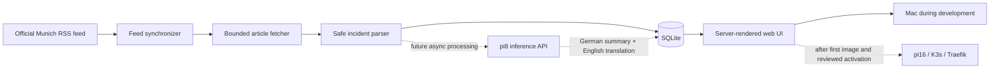

# MunichBrief

MunichBrief is a lightweight, local-first reader for press releases from the Munich Police Headquarters (`Polizeipräsidium München`). It discovers official releases, splits daily collections into individual incident cards, and presents them with clear attribution and links to the authoritative source.

The application runs locally on a Mac and is packaged for private deployment to the single-node K3s cluster on `pi16`. A separate Raspberry Pi, `pi8`, provides privacy-minimised German summarization and English translation over the LAN.

> [!IMPORTANT]
> MunichBrief is an unofficial project. The original Bavarian Police release is always authoritative. Police reports describe the state of an investigation at publication time; the presumption of innocence applies to accused and suspected persons.

## Project status

Roadmap phases 1 through 5 are implemented. The repository contains the live reader, operational endpoints and metrics, consistent SQLite backup tooling, a multi-architecture container pipeline, and a secure Helm chart. The separate `homelab-infra` repository is operational and remains the sole owner of deployment state through Argo CD; MunichBrief activation waits for the first published image digest and review of its companion infrastructure pull request.

The agreed direction is:

- local-first access at `munichbrief.home.egekocabas.com`;
- Go, server-rendered HTML, and SQLite;
- one application process and one Kubernetes replica;
- official RSS discovery followed by bounded fetching of RSS-linked articles;
- retained extracted German incident text with no automated deletion deadline for now;
- German summaries and aligned English translations produced in one request by `pi8`;
- restricted review mode now and fail-closed public mode for a later legally reviewed launch;
- deployment through the operational `homelab-infra` Argo CD path, with application CI limited to artifact publication.

Public internet access is not part of the initial release.

### Run the walking skeleton

Requirements: Go 1.26 or newer.

```bash
go run ./cmd/munichbrief
```

Open [http://127.0.0.1:8080](http://127.0.0.1:8080). The application creates `.data/munichbrief.db`, loads deterministic synthetic fixtures, and remains fully offline.

To exercise the live source explicitly, use a separate database so synthetic fixtures and official-source records remain operationally distinct:

```bash
MUNICHBRIEF_SOURCE_MODE=live \
MUNICHBRIEF_DATABASE_PATH=.data/munichbrief-live.db \
go run ./cmd/munichbrief
```

Live mode polls immediately at startup and then approximately every six hours with up to 30 minutes of jitter in either direction. It makes low-rate automated requests to RSS-linked police articles under the source-access policy and risks documented below. Routine development and CI should continue to use fixture mode.

To test AI processing safely against the synthetic fixtures, run:

```bash
MUNICHBRIEF_AI_ENABLED=true \
MUNICHBRIEF_AI_IMMEDIATE=true \
MUNICHBRIEF_OLLAMA_BASE_URL=http://192.168.178.102:11434 \
MUNICHBRIEF_OLLAMA_MODEL=qwen3.5:4b \
MUNICHBRIEF_PRESENTATION_MODE=review \
go run ./cmd/munichbrief
```

Immediate mode bypasses the default overnight processing window so the worker creates a short German title and summary plus an aligned English title and summary during local development. Processing stays outside browser requests, and the original fixture text remains visible for quality comparison.

Useful configuration:

| Variable | Default | Purpose |
| --- | --- | --- |
| `MUNICHBRIEF_ADDR` | `127.0.0.1:8080` | HTTP listen address |
| `MUNICHBRIEF_METRICS_ADDR` | `127.0.0.1:9090` | Separate internal Prometheus listener |
| `MUNICHBRIEF_DATABASE_PATH` | `.data/munichbrief.db` | SQLite database path |
| `MUNICHBRIEF_SOURCE_MODE` | `fixture` | Source provider: `fixture` or explicit `live` mode |
| `MUNICHBRIEF_PRESENTATION_MODE` | `review` for fixtures, `public` for live | `review` exposes original QA text and states; `public` serves only current privacy-safe AI output |
| `MUNICHBRIEF_SECURE_COOKIES` | `false` | Set the language preference cookie's `Secure` attribute; enabled by the TLS Helm deployment |
| `MUNICHBRIEF_PAGE_SIZE` | `20` | Timeline incidents per page, from 1 to 100 |
| `MUNICHBRIEF_FEED_URL` | Official Munich RSS URL | Live discovery feed; must be HTTPS |
| `MUNICHBRIEF_USER_AGENT` | Repository-identifying development agent | Identifies outbound source requests; must retain the repository URL |
| `MUNICHBRIEF_HTTP_TIMEOUT` | `10s` | Per-request live source timeout; minimum one second |
| `MUNICHBRIEF_ARTICLE_REFRESH_INTERVAL` | `6h` | Maximum age before an unchanged article can be refreshed |
| `MUNICHBRIEF_AI_ENABLED` | `false` | Enable asynchronous Ollama processing |
| `MUNICHBRIEF_AI_IMMEDIATE` | `false` | Process AI jobs at any time, ignoring the configured window; useful for local development |
| `MUNICHBRIEF_AI_WINDOW` | `03:00-08:00` | Europe/Berlin wall-clock window in which new Ollama requests may start when immediate mode is off |
| `MUNICHBRIEF_OLLAMA_BASE_URL` | `http://127.0.0.1:11434` | Ollama LAN or local base URL |
| `MUNICHBRIEF_OLLAMA_MODEL` | `qwen3.5:4b` | Exact Ollama model tag recorded with generated content |
| `MUNICHBRIEF_AI_INTERVAL` | `5s` | How often an idle worker checks for new jobs |
| `MUNICHBRIEF_AI_TIMEOUT` | `10m` | Timeout for one model request; processing remains sequential |
| `MUNICHBRIEF_AI_CONTEXT_SIZE` | `8192` | Ollama context size, from 2048 to 32768 |

Run the test suite with:

```bash
go test ./...
```

Parser regression fixtures are handcrafted, anonymized structural equivalents of official bundled and standalone pages; complete article copies are not committed. Two networked checks remain explicitly opt-in:

```bash
MUNICHBRIEF_LIVE_TEST=1 go test -run TestLiveMunichSource -v ./internal/source
MUNICHBRIEF_KNOWN_PAGE_TEST=1 go test -run TestLiveKnownPageShapes -v ./internal/source
```

The second command currently checks official articles `107252`, `107292`, and `107230`. It is time-limited by the source site's retention and must never be part of routine CI.

## Goals

- Reliably discover current Munich Police press releases.
- Represent each incident separately, including incidents published inside a combined daily release.
- Preserve source provenance and make the official release easy to open.
- Remain useful when the police website or `pi8` is temporarily unavailable.
- Run comfortably on Raspberry Pi hardware.
- Support deterministic local development without requiring live external requests.
- Be packaged for ARM64 K3s deployment without making Kubernetes part of the inner development loop.
- Keep source retention explicit and operator-reviewed rather than deleting records implicitly.
- Start with useful logs, health checks, and metrics rather than adding observability after failures occur.

## Non-goals

The initial product will not include:

- a public REST API;
- user accounts, comments, or personalization;
- advertising, analytics, or third-party browser assets;
- maps, native mobile applications, or push notifications;
- archive-wide crawling or historical imports beyond the RSS window;
- multiple application replicas or high-availability storage;
- automatic incident relationships inferred only from similar dates or titles;
- a public Cloudflare route before a separate public-readiness review.

## Source research and constraints

### Official feed

Discovery will use the dedicated [Munich Police RSS feed](https://www.polizei.bayern.de/rss/polizeiprasidium-munchen.xml), rather than the association filter on the general press-release page.

The Bavarian Police describes its feeds as notifications for newly published or changed articles. Feed entries provide a title, introductory information, publication date, and source link. The documented feed is a small rolling window, so it is a discovery mechanism rather than a historical archive. See the [official RSS documentation](https://www.polizei.bayern.de/aktuelles/001127/index.html).

The feed has some details the implementation must not assume away:

- it does not reliably provide a GUID, so the canonical article URL and numeric police article ID form the external identity;
- publication timestamps may not include an explicit time zone and will be interpreted as `Europe/Berlin`;
- the number of available entries is not a stable contract;
- an entry disappearing from the rolling feed does not mean it should immediately be deleted locally.

### Daily and standalone releases

One RSS item represents a **source document**, not necessarily one incident.

The Munich Police commonly publishes a daily media release containing several numbered incidents. Important or time-sensitive incidents may also be published as standalone releases. Consequently:

- one source document may contain one or many incidents;
- combined releases will become multiple incident cards sharing the same official source;
- standalone releases will become one incident card;
- releases will never be merged merely because they share a publication date.

The [Munich press office](https://www.polizei.bayern.de/aktuelles/presse/erreichbarkeiten/005075/index.html) says its regular daily report is generally published around 14:00, although separate reports can appear at other times. It also states that media information remains online for approximately one year.

### Automated access and reuse risk

The source site's [robots.txt](https://www.polizei.bayern.de/robots.txt) disallows automated crawling. The selected policy for the private prototype is to proceed with low-rate fetching only for article URLs explicitly delivered by the official Munich RSS feed. MunichBrief will not crawl the general listing or press archive.

This is a known project risk, not a conclusion that all automated reuse is permitted. Before any public launch, the operator must reassess:

- automated source access and the site's current policies;
- copyright and permitted reuse;
- publication of personal information contained in police reports;
- source attribution and modification requirements;
- imprint and privacy obligations;
- whether written confirmation from the source owner is appropriate.

The project will not claim that every police release automatically falls under the same copyright exception. [Section 5 of the German Copyright Act](https://www.gesetze-im-internet.de/urhg/__5.html) requires a case-specific assessment and includes source and alteration considerations for qualifying official works.

## System overview



The application will be one Go process responsible for HTTP serving, scheduled synchronization, parsing, and database access. This avoids sharing SQLite between worker and web pods and keeps resource usage predictable.

## MVP requirements

### Discovery and synchronization

- Synchronize immediately at application startup and approximately every six hours with up to 30 minutes of jitter.
- Retry failed feed synchronization with exponential backoff capped at 30 minutes before resuming the normal schedule.
- Seed releases from the current Munich calendar date and the preceding two calendar dates.
- Use `ETag` and `Last-Modified` for conditional RSS requests.
- Canonicalize and validate article URLs before persistence or fetching.
- Permit only HTTPS URLs on the expected Bavarian Police host.
- Follow only same-origin redirects.
- Apply request timeouts and response-size limits.
- Send an identifiable `User-Agent` containing the repository URL.
- Fetch one article at a time with bounded retries and backoff.
- Refresh in-scope articles at a bounded frequency when the feed changes so amendments can be detected.
- Normalize and hash parsed content so unchanged releases do not create revisions or duplicate incidents.
- Make every synchronization operation idempotent and safe to repeat after a restart.
- If the rolling feed does not cover all three requested calendar dates, record a partial seed rather than crawling the archive.

### Failure behavior

- Preserve already stored releases when the source is unavailable.
- Retain RSS metadata when an article fetch or parse fails.
- Render a link-only source card for a release that cannot be parsed.
- Never serve a downloaded page as unparsed HTML.
- Do not fail application readiness merely because the police source or `pi8` is unavailable.
- Expose errors through structured logs and metrics without logging article bodies.

## Parsing model

The parser will operate only inside the authoritative article content region. It requires the `bp-presse` marker and, when present, uses its enclosing `main#readspeaker_lesen` region because current bundled releases place detailed incident sections next to the headline/table-of-contents section rather than inside it.

1. Read the official page title, organization, and publication timestamp.
2. Locate numbered `h2` or `h3` headings such as `1244.` and use them as incident boundaries.
3. Ignore the repeated table-of-contents section found before the detailed incidents in daily bundles.
4. Preserve paragraphs and subordinate headings, including witness appeals, as ordered plain-text blocks.
5. End an incident at the next numbered incident heading or the end of the press content.
6. Escape all content when rendering it.

Scripts, navigation, arbitrary HTML attributes, images, and footer content will not be persisted. Raw source HTML will be discarded after successful parsing.

Future follow-up relationships may be added only when a release contains an explicit reference such as `siehe Medieninformation ... Nr. ...`. Date or title similarity alone will not create a relationship.

## Technical design

### Application

- Go with the standard `net/http` server.
- Server-rendered pages using `html/template`.
- Minimal first-party JavaScript only where progressive enhancement materially improves the interface.
- Responsive and accessible semantic HTML.
- SQLite accessed through a pure-Go driver for simpler AMD64 and ARM64 builds.
- Embedded, versioned database migrations.
- Structured JSON logs with request and correlation IDs.
- Configurable clients and clock for deterministic tests.
- One process and one application replica.

### Data model

#### `source_documents`

Represents an RSS-linked official page.

- canonical source URL;
- numeric police article ID;
- source title;
- publication timestamp;
- discovery and last-seen timestamps;
- feed fingerprint;
- fetch and parser status;
- normalized source hash;
- last fetch time and sanitized error state.

#### `incidents`

Represents one numbered incident extracted from a source document.

- source document reference;
- incident number, when available;
- order within the source document;
- German title;
- temporary German body as ordered text;
- normalized content hash;
- creation and update timestamps.

#### `derivations`

Represents future machine-generated content and its provenance.

- incident reference and source hash;
- German summary;
- English summary;
- district and category metadata;
- model identity;
- prompt version;
- generation timestamp.

#### `processing_jobs`

Represents durable asynchronous work for `pi8`.

- incident and source hash;
- requested operation;
- status and attempt count;
- next retry time;
- sanitized last error.

#### `sync_state`

Stores source synchronization state.

- feed `ETag` and `Last-Modified` value;
- last attempt and success timestamps;
- most recent synchronization result.

Database constraints will enforce source and incident identity so repeated polls and restarts cannot create duplicates.

## User experience

### Routes

| Route | Purpose |
| --- | --- |
| `GET /` | Paginated incident timeline grouped by publication date |
| `GET /incidents/{id}` | Incident detail, attribution, and official source link |
| `GET /about` | Methodology, source policy, retention policy, and AI disclaimer |
| `GET /healthz` | Process liveness |
| `GET /readyz` | Database and migration readiness |
| Internal listener: `GET /metrics` | Prometheus metrics; absent from the reader listener and ingress |

There will be no public REST API in the first version.

Every incident view will display:

- the official publication date;
- source document title;
- incident number when available;
- last processing time;
- a prominent link to the original release;
- an unofficial-service and presumption-of-innocence notice;
- a machine-generated label once summaries or translations are introduced.

## AI processing on pi8

The application must continue synchronizing and serving existing data when `pi8` is unavailable. AI processing will therefore be asynchronous and outside browser request paths.

During the configured `03:00-08:00` Europe/Berlin processing window, the worker creates current processing jobs for every stored incident that has a German body but no job for the active source hash, model, and prompt version. This includes historical incidents and incidents whose only AI output is stale. Ready work is processed from the newest publication to the oldest; a request already in progress may finish after the window closes, but no new request starts outside the window. Immediate mode bypasses the window for local development.

The application-facing processing operation creates one aligned presentation and privacy assessment:

```text
Present(GermanIncident) -> GermanTitle + GermanSummary + EnglishTitle + EnglishSummary + PrivacyStatus
```

The processing sequence is:

1. Generate a fact-constrained German title and summary from the German incident body.
2. Generate aligned English translations in the same structured response.
3. Require the model's privacy assessment and validate schema, lengths, and recognizable direct identifiers.
4. Persist only privacy-safe output and record source hash, model, prompt version, and processing time.
5. Retain the stored German body indefinitely for now; deletion remains a later operator-reviewed step.

The LAN base URL, timeouts, model names, and optional authorization token will be configurable. Secrets will not be committed. The `pi8` inference port should be restricted to `pi16` at the host firewall or equivalent network boundary.

Transient endpoint failures use capped backoff and a circuit breaker. Release-specific malformed or privacy-uncertain output yields to the next release and becomes `needs_review` after three attempts. Processing is idempotent for the combination of incident source hash, operation, model, and prompt version.

The initial model is `qwen3.5:4b`. Model identity and prompt version are part of job and derivation identity, so changing either queues a fresh presentation without overwriting provenance.

## Retention

- Store parsed German bodies so the restricted local reader remains useful and AI output can be reviewed.
- Never retain raw downloaded HTML after parsing.
- Keep source metadata, extracted German text, derived presentations, and provenance without an automated deletion deadline for now.
- Do not render stored originals in public mode, even after AI succeeds.
- Treat this as an explicit temporary operational policy, not a conclusion that indefinite storage is legally permissible. A later deletion or review policy requires legal and operator approval.

## Local development strategy

Fixture-based development will be the default. Routine tests must not require the police website.

Development support includes:

- synthetic RSS and HTML fixtures for bundled and standalone releases;
- no complete real-world article bodies committed as fixtures;
- a temporary or explicitly configured local SQLite database;
- a fixture source mode for deterministic development;
- an explicit opt-in live-source mode for manual integration testing;
- documented commands for development, tests, migrations, one-shot synchronization, and production-style container execution.

The first implementation milestone was a vertical walking skeleton: fixture ingestion, one timeline card, and one detail page. The parser and operational features now grow around that visible flow.

## CI and container packaging

Pull requests run:

- formatting and static analysis;
- unit and integration tests;
- race tests where supported;
- template-rendering and escaping tests;
- Helm lint and template security checks;
- a container build without publishing.

Trusted `main` builds will publish immutable commit-SHA images to:

```text
ghcr.io/egekocabas/munichbrief
```

Release tags will additionally publish the original `vMAJOR.MINOR.PATCH` tag and normalized semantic-version tags. Images will target `linux/amd64` for local development and `linux/arm64` for pi16 using GitHub-hosted runners initially. See [GitHub's container publishing guidance](https://docs.github.com/en/actions/tutorials/publish-packages/publish-docker-images).

Future self-hosted runners must not automatically execute untrusted fork pull requests.

## Kubernetes and GitOps

The Helm chart is packaged in this repository for validation and reuse. The operational `homelab-infra` repository owns the concrete pi16 desired state, while Argo CD performs reconciliation.

Deployment defaults:

- namespace: `munichbrief`;
- internal hostname: `munichbrief.home.egekocabas.com`;
- one replica;
- `Recreate` rollout strategy;
- K3s local-path `ReadWriteOnce` PVC mounted at `/data`;
- ClusterIP Service and Traefik Ingress;
- liveness and readiness probes;
- non-root container user;
- read-only root filesystem;
- all Linux capabilities dropped;
- only `/data` and `/tmp` writable;
- conservative CPU and memory requests and limits for pi16;
- configuration through a ConfigMap and credentials through Secrets;
- NetworkPolicy allowing DNS, HTTPS to the official source, and the configured `pi8` endpoint;
- image pinned by digest in the GitOps repository;
- no PodDisruptionBudget for a single-node, single-replica application.

Kubernetes [`ReadWriteOnce`](https://kubernetes.io/docs/concepts/storage/persistent-volumes/) restricts a volume to one node, but it can still allow multiple pods on that node. The fixed replica count and `Recreate` strategy are therefore required for SQLite safety.

GitHub Actions builds and publishes artifacts but has no cluster credentials. Release tags and immutable commit tags are published to GHCR; Renovate will later propose version/digest changes in `homelab-infra`, and Argo CD owns reconciliation after those changes are reviewed and merged.

## Observability and recovery

The runnable version provides:

- structured JSON logs with request and correlation IDs;
- AI request start, validated response, persistence/failure category, attempt, and human/numeric duration;
- RSS request/response and synchronization counts with durations;
- per-release fetch, parse, and storage lifecycle events with document IDs, byte/incident counts, and durations;
- liveness and readiness endpoints;
- Prometheus metrics for feed attempts, failures, duration, and the next scheduled check;
- last successful synchronization and AI processing times;
- source HTTP response classes;
- items discovered and updated;
- parser failures;
- processing queue depth and age, AI duration, processor availability, and processing-window state;
- retention deletions.

Alerts should report failed synchronization rather than merely an absence of new articles, because legitimate publication frequency varies around weekends and holidays.

Prometheus scraping and alerts integrate with the existing homelab observability stack. OpenTelemetry traces and deeper Grafana/Loki/Tempo integration remain later work.

The application provides a consistent SQLite backup command and documented restore procedure in [`docs/operations.md`](docs/operations.md). Scheduled backups must eventually leave the application's local PVC so a failed NVMe or cluster rebuild does not destroy the only recoverable copy.

## Security and privacy principles

- Treat fetched HTML and all AI output as untrusted input.
- Persist escaped structured text, not arbitrary source HTML.
- Apply strict outbound host, redirect, response-size, and timeout policies.
- Keep article bodies, prompts, and model responses out of logs and traces.
- Collect no reader accounts, analytics identifiers, or unnecessary request data.
- Keep application, CI, GitOps, and `pi8` credentials separate.
- Expose metrics and operational endpoints internally.
- Label summaries and translations clearly and link to the original context.
- Review legal, privacy, and public-security requirements again before any internet-facing release.

## Roadmap

### 1. Documentation

- **Complete.** The product, source behavior, boundaries, architecture, risks, and acceptance criteria are documented.

### 2. Local walking skeleton

- **Complete.** The Go module and application layout are established.
- Embedded schema migrations and fixture-backed source clients are implemented.
- The server-rendered timeline and incident detail flow are working.
- The fixture-to-SQLite-to-browser path is covered by automated tests and a local smoke test.

### 3. Live ingestion MVP

- **Complete.** Conditional RSS synchronization and three-calendar-day seeding are implemented.
- Article fetching is sequential, restricted to the official HTTPS host allowlist, size-limited, and time-bounded; redirects must remain on the exact request origin.
- Numbered `h2`/`h3` release parsing stores normalized plain text rather than source HTML, and templates escape it on output.
- Persistence is idempotent and retains metadata or previous incidents when a fetch or parse fails.
- Combined and standalone structures are covered by parser and end-to-end synchronization tests.

### 4. Local product MVP

- **Complete.** Pagination, methodology notices, health, readiness, and separate internal metrics are implemented.
- The responsive interface and non-root production container are packaged.
- Consistent SQLite backup and restore operations are documented.
- Local and container execution remain available without Kubernetes.

### 5. Release and GitOps readiness

- **Implementation complete; activation pending.** Trusted workflows build and publish AMD64/ARM64 GHCR images from `main` and semantic release tags.
- The Helm chart enforces the single-replica SQLite model and secure runtime defaults.
- A companion `homelab-infra` pull request prepares the pi16 configuration and Argo CD Application without activating it before the first image exists.
- Renovate-based release updates are planned there; until Renovate is installed, image pins are updated through reviewed pull requests.

### 6. pi8 summarization and translation

- **Privacy-safe review implementation complete.** One Ollama request creates German/English titles, summaries, and a privacy assessment with deterministic identifier checks, provenance, categorized retries, circuit breaking, and restart-safe jobs.
- Continue synthetic quality evaluation of `qwen3.5:4b` and refine the versioned prompt when evidence requires it.
- Keep stored source bodies indefinitely for now; any deletion policy remains an explicit future legal and operator decision.

### 7. Public-readiness review

- Reassess automated source access and permitted reuse.
- Review personal-data handling, attribution, imprint, and privacy requirements.
- Add appropriate Cloudflare controls, rate limiting, and browser security headers.
- Confirm that metrics and administrative information are not publicly exposed.
- Only then consider `munichbrief.egekocabas.com`.

### 8. Later product features

- District and category filters.
- Search across derived summaries.
- Explicitly referenced follow-up relationships.
- Optional source-amendment history.
- Operational alerts.

Maps, accounts, comments, notifications, native applications, and highly available deployment remain out of scope unless separately planned.

## Test plan

### Feed and synchronization

- Missing descriptions and publication time zones.
- Malformed XML and oversized responses.
- Duplicate, changed, and removed rolling-window entries.
- Invalid or off-domain article URLs.
- Initial seed, repeated poll, restart, and concurrent-trigger idempotency.
- `200`, `304`, timeout, retry, redirect, and source outage behavior.

### Article parser

- A bundled release producing several ordered incidents.
- A standalone numbered release producing one incident.
- Non-incident headings inside an incident.
- Missing or changed content containers.
- Source amendments and unchanged-content hashes.
- Hostile markup that must never reach rendered output.

### Database and UI

- Unique source and incident identities.
- Safe migrations and rollback behavior.
- No duplication after process restarts.
- Empty and metadata-only states.
- Bundled and standalone detail rendering.
- Pagination, attribution, disclaimers, and output escaping.

### AI, privacy, and retention

- `pi8` unavailability, timeouts, malformed output, circuit breaking, and privacy-review states.
- Source changes during processing.
- Aligned German and English results.
- Provenance for model and prompt versions.
- Review/public visibility and current prompt/model/source provenance.
- Original-body retention without automated deletion.

### Packaging

- AMD64 and ARM64 container builds and startup checks where CI supports them.
- Helm linting and rendering.
- Verification of the single-replica, PVC, rollout, probe, and security defaults.
- Opt-in live-source smoke tests that are never required by ordinary CI.

## MVP acceptance criteria

The local MVP is complete when a clean start can:

1. discover every available Munich feed item from today and the preceding two Munich calendar dates;
2. split combined and standalone pages into correctly ordered incident records;
3. render those records safely with authoritative source links and notices;
4. repeat synchronization and restart without creating duplicates;
5. preserve and serve existing data during source outages;
6. expose useful health, readiness, logging, and synchronization metrics;
7. build as a production container for both local development and pi16.

## Fixed assumptions

- “Three-day backfill” means today plus the preceding two calendar dates in `Europe/Berlin`.
- Missing historical items will not trigger an archive crawl.
- Full German bodies are retained indefinitely for now but are visible only in restricted review mode.
- Public mode never renders stored originals and publishes only current privacy-safe AI output.
- English output is a translation of the accepted German summary.
- Local-first access, Go, SQLite, server rendering, one replica, and GitOps-only K3s deployment are fixed decisions.
- `qwen3.5:4b` is the initial model; model and prompt changes create fresh processing identities.

## References

- [Munich Police RSS feed](https://www.polizei.bayern.de/rss/polizeiprasidium-munchen.xml)
- [Bavarian Police RSS documentation](https://www.polizei.bayern.de/aktuelles/001127/index.html)
- [Munich Police press office and publication information](https://www.polizei.bayern.de/aktuelles/presse/erreichbarkeiten/005075/index.html)
- [Latest Bavarian Police press releases](https://www.polizei.bayern.de/aktuelles/pressemitteilungen/index.html)
- [Bavarian Police robots.txt](https://www.polizei.bayern.de/robots.txt)
- [German Copyright Act, Section 5](https://www.gesetze-im-internet.de/urhg/__5.html)
- [EU General Data Protection Regulation](https://eur-lex.europa.eu/legal-content/EN/TXT/?uri=celex%3A32016R0679)
- [BfDI guidance on data protection and the press](https://www.bfdi.bund.de/DE/Buerger/Inhalte/Allgemein/Datenschutz/Datenschutz_Presse.html)
- [GitHub documentation: publishing Docker images](https://docs.github.com/en/actions/tutorials/publish-packages/publish-docker-images)
- [Kubernetes documentation: persistent volumes](https://kubernetes.io/docs/concepts/storage/persistent-volumes/)
