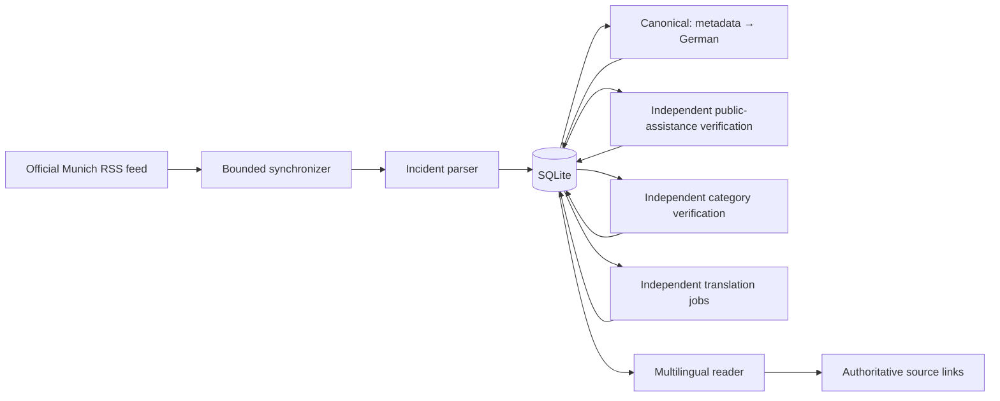

# MunichBrief

[](https://github.com/egekocabas/munichbrief/actions/workflows/ci.yml)
[](LICENSE)

MunichBrief turns official Munich Police press releases into a clear multilingual
incident reader. It discovers the official RSS feed, separates combined daily
releases into individual reports, and publishes privacy-minimised German
summaries and translations in English, Turkish, Croatian, Italian, Ukrainian,
Bosnian, Simplified Chinese, Hindi, Spanish, French, Romanian, Polish,
and Russian with provenance and links to the authoritative source.

Visit the live reader at [munichbrief.de](https://munichbrief.de).

> [!IMPORTANT]
> MunichBrief is independent and unofficial. The original Bavarian Police
> release is always authoritative. Reports describe the state of an
> investigation at publication time, and the presumption of innocence applies
> to accused and suspected persons.

## Highlights

- Local-first Go application with server-rendered HTML and SQLite.
- Deterministic fixture mode for offline development and tests.
- Bounded, low-rate ingestion of RSS-linked official articles.
- Metadata-first Ollama processing: a two-stage canonical German pipeline plus
  independent public-assistance verification, category verification, and
  per-language translation jobs.
- A separately refreshed Munich-area gazetteer protects official place names
  with deterministic placeholders before any translation request.
- Fail-closed public presentation: retained source text is never rendered on a
  public host.
- Protected operational review, structured logs, health checks, and Prometheus
  metrics.
- Multi-architecture container images and a security-hardened Helm chart.
- HTML and Markdown representations with canonical multilingual discovery links.

## Quick start

Requirements: Go 1.26.6 or newer.

```bash
go run ./cmd/munichbrief
```

Open <http://127.0.0.1:8080>. The default fixture mode remains offline, creates
`.data/munichbrief.db`, and loads synthetic reports.

Run the main validation suite with:

```bash
go test -race ./...
go vet ./...
```

Frontend assets are embedded in the Go binary. Node.js is needed only when
their sources or pinned dependencies change:

```bash
nvm use
npm ci
npm run build
git diff --exit-code -- internal/web/static
```

See [the development guide](docs/development.md) for live-source, Ollama, and
complete validation commands.
See [Adding a reader language](docs/adding-a-language.md) for the registry,
translation, discovery, and deployment workflow.
See [Pre-merge translation testing](docs/pre-merge-translation-testing.md) for
the model-routing, live-matrix, and native-review release gate.

## How it works



One process owns HTTP serving, scheduled synchronization, parsing, SQLite, and
the sequential processing worker. Public hosts receive only complete,
privacy-safe presentations for the current source and prompt versions. Review
mode retains the original text for local or protected quality control.

The detailed component, data-flow, and trust-boundary design is documented in
[Architecture](docs/architecture.md). Source contracts and refresh behavior are
documented in [Place-name gazetteer](docs/gazetteer.md).

## Configuration

Common settings:

| Variable | Default | Purpose |
| --- | --- | --- |
| `MUNICHBRIEF_ADDR` | `127.0.0.1:8080` | Reader listen address |
| `MUNICHBRIEF_METRICS_ADDR` | `127.0.0.1:9090` | Internal metrics listener |
| `MUNICHBRIEF_DATABASE_PATH` | `.data/munichbrief.db` | SQLite database path |
| `MUNICHBRIEF_GAZETTEER_DATABASE_PATH` | `.data/munichbrief-gazetteer.db` | Rebuildable gazetteer SQLite path |
| `MUNICHBRIEF_GAZETTEER_ENABLED` | live-mode dependent | Refresh and require the place-name gazetteer |
| `MUNICHBRIEF_GAZETTEER_REFRESH_INTERVAL` | `168h` | Successful gazetteer refresh interval |
| `MUNICHBRIEF_GAZETTEER_HTTP_TIMEOUT` | `2m` | Timeout for one gazetteer source request |
| `MUNICHBRIEF_SOURCE_MODE` | `fixture` | `fixture` or explicit `live` ingestion |
| `MUNICHBRIEF_PRESENTATION_MODE` | mode-dependent | Local `review` or fail-closed `public` |
| `MUNICHBRIEF_PUBLIC_HOSTS` | empty | Hosts forced through public path and content restrictions |
| `MUNICHBRIEF_CANONICAL_ORIGIN` | empty | Canonical HTTPS origin for public hosts |
| `MUNICHBRIEF_ADMIN_ENABLED` | `false` | Enable protected review and processing routes |
| `MUNICHBRIEF_AI_ENABLED` | `false` | Enable asynchronous Ollama processing |
| `MUNICHBRIEF_OLLAMA_BASE_URL` | `http://127.0.0.1:11434` | Local or protected Ollama endpoint |

All variables and operational commands are covered in
[Operations](docs/operations.md).

## Deployment

The container runs as a non-root user with a read-only root filesystem and
writable `/data` and `/tmp` mounts. The Helm chart disables ingresses and AI by
default and starts in deterministic fixture/review mode.

```bash
helm install munichbrief ./charts/munichbrief \
  --namespace munichbrief \
  --create-namespace
```

Use [the sanitized example values](deploy/example-values.yaml) as a starting
point for a public deployment. Keep credentials, private hostnames, IP
addresses, and the actual desired image digest in a separate infrastructure
repository.

## Safety and source policy

MunichBrief stores and transforms sensitive source material. Its public output
is intentionally narrower than the retained operational data. Automated
access, copyright, personal information, attribution, and retention require
ongoing operator review; source availability is not treated as blanket
permission to republish it.

Read [Source, privacy, and retention](docs/source-policy.md) before enabling live
ingestion or a public route. Report software vulnerabilities privately as
described in [Security](SECURITY.md).

For the AI Act transparency rationale, visible and machine-readable disclosure
controls, operational review points, and legal-status limitations, read
[EU AI transparency and compliance posture](docs/eu-ai-transparency.md).

## Contributing

Contributions are welcome. Start with [CONTRIBUTING.md](CONTRIBUTING.md), follow
the [Code of Conduct](CODE_OF_CONDUCT.md), and use Conventional Commits for
commit messages and pull-request titles.

MunichBrief is available under the [MIT License](LICENSE).
