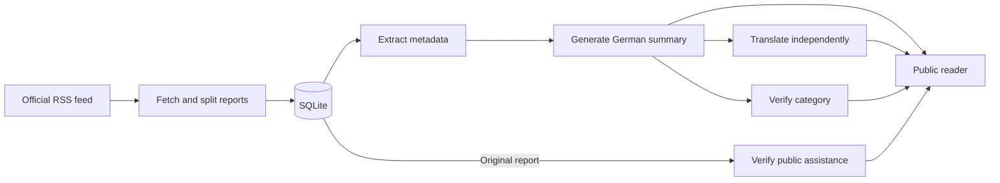

# From release to reader

One Go process serves the reader and runs the background workers. SQLite keeps
incidents, processing jobs, and their history; a second database holds place names.

## The journey

1. **Discover.** Read the official Munich Police RSS feed. Fetch only linked
   articles within the seven-day discovery window, with bounded requests.
2. **Split.** Separate a combined release into incidents. Keep source URLs,
   publication times, and content hashes so changes can be detected.
3. **Summarize.** Extract structured metadata, then generate a shorter German
   title and summary. Validate the result before making it public.
4. **Check and translate.** Independent jobs verify categories and appeals for
   public assistance, or translate the accepted German text. One failed
   translation does not stop German or other languages from publishing.
5. **Serve.** Select only complete, current results. A source change makes old
   generated results ineligible until the updated report has been processed.

## The reader

- Go templates render HTML; HTMX updates parts of the page without a full reload.
- Search and filters query SQLite. Timelines can use publication or incident date.
- Language URLs are explicit, such as `/de` and `/en`.
- Canonical links, language alternatives, sitemaps, and share images describe
  the same published reports. `Accept: text/markdown` requests Markdown.
- Original text and processing controls belong to protected administration.

## Find the code

| Area | Package |
| --- | --- |
| Startup, configuration, commands | [cmd/munichbrief](../cmd/munichbrief/main.go) |
| Feed and article access | [source](../internal/source/source.go) |
| Incident splitting | [parser](../internal/parser/police.go) |
| Synchronization | [ingest](../internal/ingest/syncer.go) |
| Jobs, model adapters, validation | [processing](../internal/processing/README.md) |
| SQLite and migrations | [store](../internal/store/README.md) |
| Routes, templates, localization | [web](../internal/web/README.md) |

See [translation](translation.md) for language handling and
[privacy and sources](source-policy.md) for the publication boundary.
